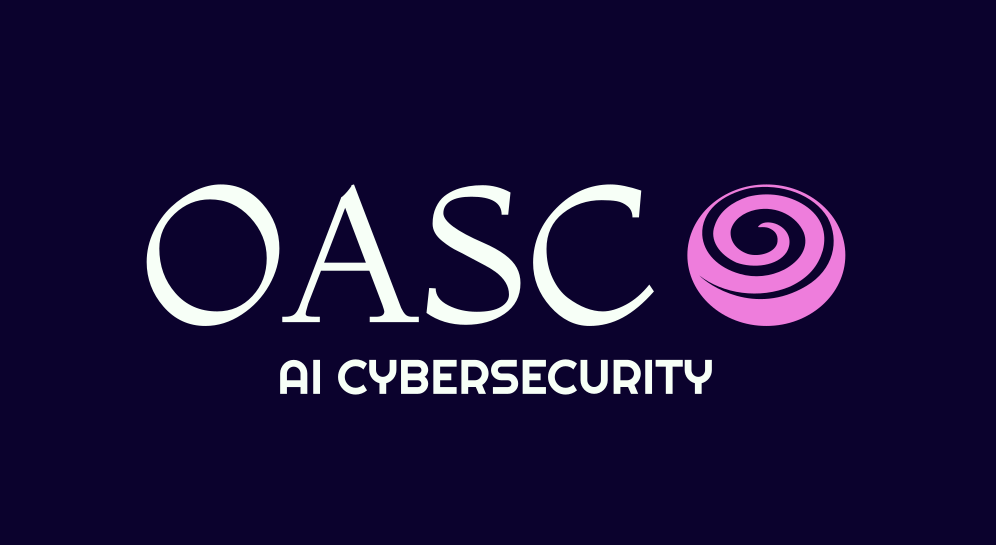
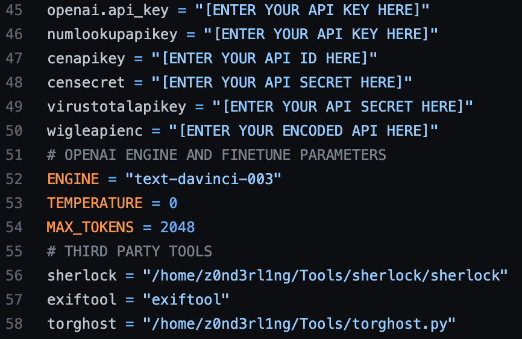

<h2>AI-powered Cybersecurity Framework</h2>

<h3>Requirements</h3>
 

  Enter your API keys for all third party services and set the paths after installing <a href="https://exiftool.org/">exiftool</a>, <a href="https://github.com/sherlock-project/sherlock">sherlock</a> and <a href="https://github.com/SusmithKrishnan/torghost">torghost</a>

<h3>API Keys</h3>
<ul>
<li><a href="https://platform.openai.com/account/api-keys">OpenAI</a></li>
<li><a href="https://app.numlookupapi.com/api-keys">Numlookup</a></li>
<li><a href="https://search.censys.io/account/api">Censys</a></li>
<li><a href="https://www.virustotal.com/gui/home/upload">Virustotal</a></li>
<li><a href="https://wigle.net/accounthttps://wigle.net/account">Wigle</a></li>
</ul>

